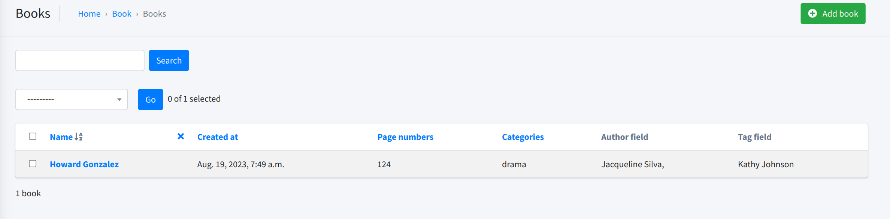

# Requirements
```bash
mkdir backend
cd backend
# Create a virtual environment to isolate our package dependencies locally
python3 -m venv venv

# 
# The virtual environment was not created successfully because ensurepip is not
# available.  On Debian/Ubuntu systems, you need to install the python3-venv
# package using the following command.

#     apt install python3.10-venv

# You may need to use sudo with that command.  After installing the python3-venv
# package, recreate your virtual environment.

sudo apt install python3.10-venv
source venv/bin/activate  # On Windows use `env\Scripts\activate
pip install django
# Install Django and Django REST framework into the virtual environment
pip install django
# stabel version
pip install Django==4.2.4
python -m django --version

pip install djangorestframework
pip install djangorestframework-simplejwt
pip install requests
pip install django-filter

pip freeze > requirements.txt
```
## Start Project

```bash
# Set up a new project with a single application
django-admin startproject backend .  # Note the trailing '.' character

# Set up a app 
django-admin startapp authentication


# migrate
# python manage.py migrate first make custom user model
# createsuperuser
python manage.py createsuperuser --email admin@example.com --username admin

```
## .git
```bash
Create a .gitignore file in the main app directory
touch .gitignore
nano .gitignore
cat .gitignore
add venv/ to gitignore file to ignore venv You may also need to add the following
```
## env
```bash
python -m pip install django-environ
pip freeze > requirements.txt

### setings
import environ


env = environ.Env(
    # You can set default values here
    DEBUG=(bool, False)
)
environ.Env.read_env()

SECRET_KEY = env('SECRET_KEY')
DEBUG = env('DEBUG')

### env file
SECRET_KEY='django-insecure-*sz4x8jnl8&%@u^y-m63mro98x_$=5bgh54w^w)_fhg3662z22'
DEBUG=True

#
touch .env.example
```

# admin
```bash
# Installing jazzmin
pip install django-jazzmin
pip freeze > requirements.txt

INSTALLED_APPS = [
    #first line
    'jazzmin',

    'django.contrib.admin',
    [...]
]
```
# Structure
```bash
django-admin startapp book
django-admin startapp author

## settings 
INSTALLED_APPS = [
     # admin
    'jazzmin',
    'django.contrib.admin',
    'django.contrib.auth',
    'django.contrib.contenttypes',
    'django.contrib.sessions',
    'django.contrib.messages',
    'django.contrib.staticfiles',
    'rest_framework_simplejwt',
    'rest_framework',
    'django_filters',
    # add app
    'authentication',
    'author',
    'book',
    
]
python manage.py makemigrations


```
# custumize user
```bash
class UserManager(BaseUserManager):
    pass
#ERROR
settings
AUTH_USER_MODEL = 'authentication.User'
```

# run
```bash
python manage.py runserver
python manage.py migrate
python manage.py runserver
http://127.0.0.1:8000/
http://127.0.0.1:8000/admin
```
# questions
```bash
venv => python has different packages
stable => lts version
migrations
django.db.migrations.exceptions.InconsistentMigrationHistory: Migration admin.0001_initial is applied before its dependency authentication.0001_initial on database 'default'.
delete db
model => table , 
app => similar models
fk => mtm = > rename field in model,python3 manage.py makemigrations,chnage migration file
```

# admin ?
```bash
admin
admin.py auth => make video
admin.py author
admin.py book => show fk as number ,but mtm needs custom field   ????

commands => __init__.py => becuse python needs this file to recognize folders


python manage.py createsuperuser2 --phone-number=09217928211 --password=1234
python manage.py runserver


```

## Showing M2M fields and custom data in admin
```bash
Error:<class 'book.admin.BookAdmin'>: (admin.E109) The value of 'list_display[0]' must not be a ManyToManyField.   ?
```
You can create a function to display anything you want in list/edit screens in admin
```python
class BookAdmin(admin.ModelAdmin):
    list_display = [  ..., 'author_field', 'custom_tags']
    ...
    def author_field(self, obj):
        ret = ""
        for author in obj.authors.all():
            ret += f"{author.full_name}, "
        return ret
    

    def custom_tags(self, obj):
        return format_html(
 '<a  href="{0}" >{0}</a>&nbsp;',
            obj.tags.first()
        )
```

## migartionas point 

```bash
when you change null=False to null=True, all the fields have a value
when you change null=True to null=False, some entries might be null => default
```


## rename in tag model(title to name)
```bash
Was tag.title renamed to tag.name (a CharField)? [y/N] y
python manage.py makemigrations
python manage.py migrate
python manage.py runserver
```


## front
```bash
install new format and mui  
new route?
table
```

## backend
```bash
ketab
list +   views and serializers
edit -
create - 
delete -

author
list +
edit -
create - 
delete -


INSTALLED_APPS = [
    # admin
    'jazzmin',
    'django.contrib.admin',
    'django.contrib.auth',
    'django.contrib.contenttypes',
    'django.contrib.sessions',
    'django.contrib.messages',
    'django.contrib.staticfiles',
    #rest
    'rest_framework_simplejwt',
    'rest_framework',
    'django_filters',
     # add app
    'authentication',
    'author',
    'book',
]

views => book,author
serializers => book, author
basic url => MEDIA_URL,settings 
url => from rest_framework import routers
```

## fake data

```bash
https://model-bakery.readthedocs.io/en/latest/basic_usage.html#model-relationships

pip install django-faker

INSTALLED_APPS = (

    # ...
    'django_faker',
)

FAKER_LOCALE = None    
FAKER_PROVIDERS = None 


from faker import Faker
# from model_bakery.recipe import Recipe
from author.models import Author
from authentication.models import User
from book.models import Book
from model_bakery import baker

myfake = Faker()

user = baker.make(User,
		first_name = myfake.first_name(),
		last_name = myfake.last_name(),
        phone_number = myfake.phone_number()
	)
authors = baker.make(Author,
        user = user,
		first_name = myfake.first_name(),
		last_name = myfake.last_name(),
        phone = myfake.phone_number()
	)

book = baker.make(Book,
        name = myfake.name(),
        make_m2m=True
	)

```


## POSTMAN
```bash
ubuntu version => lsb_release -a
sudo snap install postman

workspace/api development/library,team/collection name => libarary/add request

GET localhost:8000/api/books/book/

```

## 


## showing fk in postman

```bash
#  author/serializers

class BookSerializer(serializers.ModelSerializer):
    authors = AuthorSerializer() 
    tag = TagSerializer()

# Error
Original exception text was: 'ManyRelatedManager' object has no attribute 'user'.
# soultion
many=True
class BookSerializer(serializers.ModelSerializer):
    authors = AuthorSerializer(many=True) 
    tag = TagSerializer(many=True)

```
##


## min page_numbers 

```python
# 1.
class FilterPageNumbers(APIView):
    
    def get(self,request,**kwargs):
        arr = []
        for book in Book.objects.all():
            arr.append(book.page_numbers)
        min(*arr)
         return Response(data={
            "page_number_min": min(*arr),
            "page_number_max": max(*arr),
        },status=status.HTTP_200_OK)
        
# 2
min(*[book.page_numbers for book in Book.objects.value('page_numbers').all()])
min(*[book for book in Book.objects.value('page_numbers').all()], key="page_numbers")

class FilterPageNumbers(APIView):
    
    def get(self,request,**kwargs):
        page_min=min(*[book.page_numbers for book in Book.objects.value('page_numbers').all()])
         page_max=max(*[book.page_numbers for book in Book.objects.value('page_numbers').all()])
         return Response(data={
            "page_number_min": page_min,
            "page_number_max": page_max,
        },status=status.HTTP_200_OK)
# 3
class FilterPageNumbers(APIView):
    def get(self,request,**kwargs):
        page_number_min = 10000000000 
        page_number_max = 0 
        for book in Book.objects.all():
            page_number_min = min(page_number_min, book.page_numbers) 
            page_number_max = max(page_number_max, book.page_numbers) 

        return Response(data={
            "page_number_min":page_number_min,
            "page_number_max": page_number_max,
        },status=status.HTTP_200_OK)
```
* Getting min/max without for

```python
## on sepecific category => min,max
Book.objects.values('Categories').annotate(min_b=Min('page_numbers'), max_b=Max('page_numbers'))
#### out 
<QuerySet [{'Categories': None, 'min_b': 120, 'max_b': 120}, {'Categories': 1, 'min_b': 200, 'max_b': 612}, {'Categories': 2, 'min_b': 583, 'max_b': 583}]>

## man ,min on all books
Book.objects.all().aggregate(Max('page_numbers'))
Book.objects.all().aggregate(Min('page_numbers'))
```

## Fake data command
### Install
```python
https://model-bakery.readthedocs.io/en/latest/basic_usage.html#model-relationships

pip install django-faker model_bakery

INSTALLED_APPS = (

    # ...
    'django_faker',
)

FAKER_LOCALE = None    
FAKER_PROVIDERS = None 


```
### Create command
1. Create a file for the command in `[app]/management/commands/`
```python
# 
class Command(BaseCommand):

    def add_arguments(self, parser):
        """ 
        Define command parameters here with help and defaults:
        --phone-number
        """
        pass

    def handle(self, *args, **options):
        """
        Define what the command does
        """
        pass
```

2. Create a book
3. Create random page number with python randint
```python
class Command(BaseCommand):


    def handle(self, *args, **options):
        myfake = Faker()

        book = baker.make(
            Book,
            name=myfake.name(),
            page_numbers = randint(80,1500),
        )

```
4. Create FK fields(Category)
```python
class Command(BaseCommand):

    def add_arguments(self, parser):
        pass

    def handle(self, *args, **options):
        myfake = Faker()
        category, created = Category.objects.get_or_create(name="drama",slug="drama")

        book = baker.make(
            Book,
            name=myfake.name(),
            page_numbers = randint(80,1500),
            Categories = category,
        )
```
5. Create M2M fields
```python
class Command(BaseCommand):

    def add_arguments(self, parser):
        pass

    def handle(self, *args, **options):
        myfake = Faker()
        
        author = baker.make(
            Author,
            user__phone_number=myfake.phone_number(), # Access FK fields with __
            first_name = myfake.first_name(),
            last_name = myfake.last_name(),
            phone=myfake.phone_number(),
            description = myfake.paragraph(nb_sentences=3),
            address = myfake.address()
        )
        tag = baker.make(
            Tag,
            name = myfake.name(),
            slug = myfake.name(),
            active = myfake.boolean()

        )
        book = baker.make(
            ...
            authors = [author], # These are M2M so they are arrays
            tag =[tag],
        )
```

### Run the command
```commandline
python manage.py createfakedata
```



### Generating a specific number of books
```python
class Command(BaseCommand):

    def add_arguments(self, parser):
        parser.add_argument(
            '--count', dest='count', default=1, type=int,
            help='Specifies the number of books.',
        )


    def handle(self, *args, **options):
        count = options.get('count')
        ...
        for ind in range(count):
            book = baker.make(
                Book,
                name=myfake.name(),
                page_numbers = randint(80,1500),
                Categories = category,
                authors = author,
                tag =[tag],
            )

```
```commandline
python manage.py createfakedata --count=25
```
### Creating multiple authors and choosing among them
```python
class Command(BaseCommand):

    def add_arguments(self, parser):
        ...
        parser.add_argument(
            '--count-authors', dest='count_authors', default=1, type=int,
            help='Specifies the number of books.',
        )

    def handle(self, *args, **options):
        count = options.get('count')
        count_authors = options.get('count_authors')

        ...
        
        authors = [baker.make(
            Author,
            user__phone_number=myfake.phone_number(),
            first_name = myfake.first_name(),
            last_name = myfake.last_name(),
            phone=myfake.phone_number(),
            description = myfake.paragraph(nb_sentences=3),
            address = myfake.address()
        ) for ind in range(count_authors)]
        ...
        for ind in range(count):
            book = baker.make(
                ...
                authors = choices(
                    authors, 
                    k=randint(1, min(len(authors), 3)) # Select a maximum of 3 authors
                ),
            )

```
```commandline
python manage.py createfakedata --count=25 --count-authors=8

```